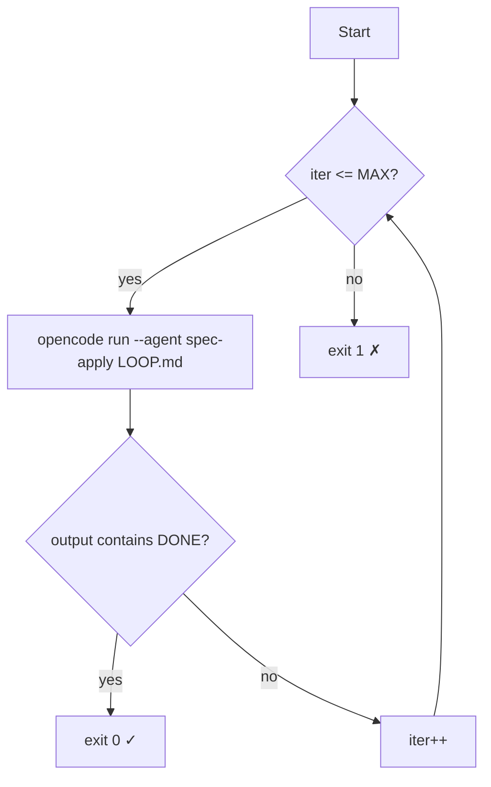
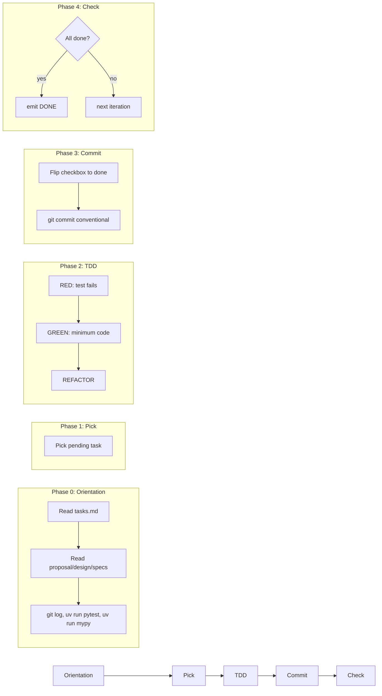
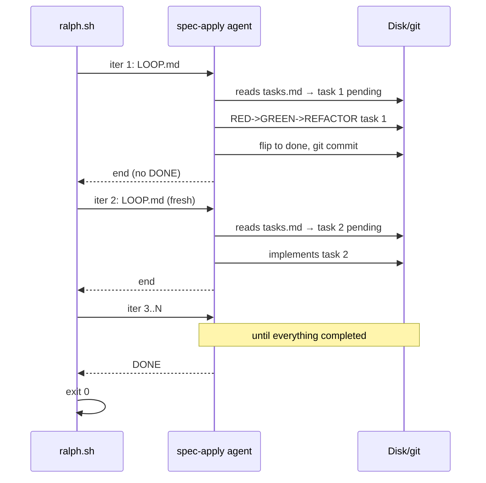

# Ralph Runner — Practical Tutorial

Automated implementation loop for the OpenSpec `spec-apply` phase.

## Loop engineering or harness?

**Both.** They are two sides of the same system:

| Component  | Is                   | Role                                                                                                                   |
|------------|----------------------|------------------------------------------------------------------------------------------------------------------------|
| `ralph.sh` | **Loop engineering** | External mechanical loop. Manages iterations, invokes the agent, detects the completion signal, handles timeouts.      |
| `LOOP.md`  | **Harness**          | Internal behavioral harness. Defines phases, rules, guardrails, and the TDD contract the agent follows each iteration. |

Together they form a **looped harness**: each iteration starts with fresh context but is constrained by a persistent
rules document.

---

## What problem does it solve?

After `openspec-propose` you have a change with `tasks.md`, `design.md` and `specs/`.
Implementing each task one by one with the `spec-apply` agent via Tab is tedious.
Ralph automates it: opens a fresh session per task, implements with TDD, commits,
and repeats until everything is `[x]`.

```
openspec-propose  ──►  ralph.sh  ──►  openspec-archive
                            |
                    ┌───────┴───────┐
                    │  loop: 1..N   │
                    │  fresh ctx    │
                    │  one task/itr │
                    └───────────────┘
```

## Architecture in one sentence

```
ralph.sh  ──shell loop──►  opencode run --agent spec-apply "$(cat LOOP.md)"
                                |
                          each iteration:
                          1. Read LOOP.md (harness)
                          2. Read tasks.md (what's left)
                          3. Implement 1 task with TDD
                          4. Commit
                          5. If all [x]: emit <promise>DONE</promise>
```

## Prerequisites

Before launching Ralph, the following must exist:

```
openspec/changes/$CHANGE/
├── tasks.md       ← tasks with - [ ] / - [x]
├── proposal.md    ← why
├── design.md      ← how, technically
└── specs/         ← Given/When/Then scenarios
```

And the project must type-check and pass tests:

```bash
uv run mypy src/   # No errors
uv run pytest      # Green tests
```

If there are no prior tests, at least the project must type-check.

## How to use

### 1. Single step to validate the harness

```bash
bash ralph-once.sh add-users-filter-pagination
```

This runs **one iteration** and you see all the output. Useful when:

- It is your first time with Ralph
- You just modified `LOOP.md` or the `spec-apply` agent
- You want to see if the agent understands the task correctly

### 2. Full loop

```bash
bash ralph.sh add-users-filter-pagination 20
```

- `add-users-filter-pagination` — directory name inside `openspec/changes/`
- `20` — maximum iterations (defaults to 20 if omitted)

Ralph iterates until:

- The agent emits `<promise>DONE</promise>` → exit 0
- N iterations are reached → exit 1



## What the agent does each iteration



## Step-by-step example

Say you created a change `add-users-filter-pagination` with 4 tasks:

```
tasks.md
- [ ] 1. Add UserFilter value object in users/domain
- [ ] 2. Add paginate/filter methods to UserRepository port + InMemory
- [ ] 3. Add ListUsersUseCase with filter + pagination
- [ ] 4. Add GET /api/users with query params + controller
```

```bash
bash ralph.sh add-users-filter-pagination 5
```

**Iteration 1:** The agent reads tasks.md, picks task 1, writes the `UserFilter` VO,
its test, commits `feat(users): add UserFilter value object`. Task 1 → `[x]`.

**Iteration 2:** Picks task 2, implements the port and the InMemory, green tests,
commits. Task 2 → `[x]`.

**Iteration 3:** Picks task 3. Implements `ListUsersUseCase` with TDD. `UserFilter`
(task 1) and the repo (task 2) already exist on disk. Commits. Task 3 → `[x]`.

**Iteration 4:** Picks task 4. FastAPI controller, route, e2e test. Commits.
Task 4 → `[x]`.

**Iteration 5:** Phase 4: verifies all tasks and all acceptance criteria are `[x]`.
Emits `<promise>DONE</promise>`. Ralph detects the sigil and does `exit 0`.



## ralph-once.sh vs ralph.sh

|                | `ralph-once.sh`                 | `ralph.sh`                    |
|----------------|---------------------------------|-------------------------------|
| Purpose        | Debug / learn                   | Production                    |
| Iterations     | 1                               | N (configurable)              |
| DONE detection | No                              | Yes                           |
| Exit code      | The agent's exit code           | 0 (DONE) / 1 (timeout)        |
| Typical use    | `bash ralph-once.sh add-filter` | `bash ralph.sh add-filter 20` |

## When NOT to use Ralph

- **During `openspec-explore`** — you are exploring, not implementing.
- **During `openspec-propose`** — you are designing, not executing.
- **For code review after implementation** — use `spec-review` via Tab.
- **To archive a completed change** — use `spec-archive` via Tab.
- **If the change does not exist** — Ralph does not create anything, it only executes existing tasks.
- **When decisions are needed** — Ralph is headless, it cannot ask questions.
  If a task requires a human decision, it will get stuck.

## Troubleshooting

| Symptom                                  | Probable cause                                            | Solution                                                                                  |
|------------------------------------------|-----------------------------------------------------------|-------------------------------------------------------------------------------------------|
| Ralph reaches max iters without DONE     | The agent did not emit the sigil                          | Run `ralph-once.sh` and check the output. Did the task not finish? Did the test not pass? |
| The agent cannot find the change         | `$CHANGE` is not exported                                 | `ralph.sh` exports it automatically. If running manually: `export CHANGE=my-change`       |
| The agent implements 2 tasks in 1 iter   | LOOP.md says "one task per loop" but the model ignores it | Reinforce the rule in LOOP.md or adjust the `spec-apply` agent's system prompt            |
| Tests fail after an iteration            | The agent left something red                              | The iteration should end with green tests + commit. If not, it's a bug in the agent       |
| `uv run mypy src/` does not catch errors | The agent used the wrong tool                             | Verify in LOOP.md that the commands are `uv run mypy src/` and `uv run pytest`            |
